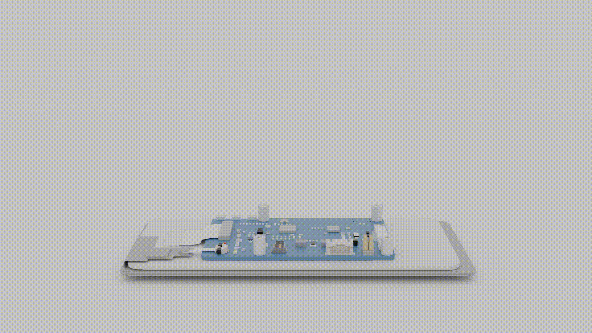

<div align="center">
<h1>Unlim8ted Phone</h1><p>A custom CM4-based handheld phone project</p>

<br>


<table>
<tr>

<td width="50%">
  <a href="https://raw.githubusercontent.com/Unlim8ted-Studio-Productions/unlim8ted-phone/refs/heads/main/3d/render.mkv">
  
</a>
</td>

<td width="50%">
  
</td>

</tr>
</table>

</div>

---

<h2>Overview</h2>

<p>
Unlim8ted Phone is a handheld phone project built around the Raspberry Pi Compute Module 4.
</p>

<p>
This repository contains the hardware, enclosure design, operating system work, and archived PCB development files for the project.
</p>

---

<h2>Repository Layout</h2>

```text
/
├─ 3d/        enclosure, renders, printable parts
├─ docs/      project documentation
├─ os/        Unlim8ted OS source and docs
├─ pcb/       archived PCB design files
└─ README.md
```

---

<h2>Hardware + Cost Breakdown</h2>

<table>

<tr>
<th align="left">Component</th>
<th align="left">Details</th>
<th align="right">Price</th>
</tr>

<tr>
<td>Compute Module</td>
<td>Raspberry Pi CM4 Lite — 8GB RAM</td>
<td align="right">$105.00</td>
</tr>

<tr>
<td>Carrier Board</td>
<td>Waveshare CM4-NANO-C</td>
<td align="right">$29.99</td>
</tr>

<tr>
<td>Display</td>
<td>Waveshare 6.25-inch DSI LCD</td>
<td align="right">$59.99</td>
</tr>

<tr>
<td>Storage</td>
<td>32GB microSD card</td>
<td align="right">$20.00</td>
</tr>

<tr>
<td>Power Board</td>
<td>Seeed LiPo Rider Plus</td>
<td align="right">$4.90</td>
</tr>

<tr>
<td>Battery</td>
<td>3.7V 3000mAh LiPo</td>
<td align="right">$12.49</td>
</tr>

<tr>
<td>Display Cable</td>
<td>15cm double-sided 15-pin DSI cable</td>
<td align="right">Included</td>
</tr>

<tr>
<td>USB Cable</td>
<td>Adafruit USB Type A → USB Type C</td>
<td align="right">$2.95</td>
</tr>

</table>

<br>

<div align="center">

<h1>$235.32</h1>

<sub>Current estimated build total</sub>

</div>

---

<h2>PCB Status</h2>

<p>
The PCB files inside <code>/pcb</code> are archived only.
</p>

<p>
The original custom PCB revision was abandoned in favor of already-manufactured off-the-shelf boards.
</p>

<p>
These files are preserved strictly for reference purposes and should not be used for fabrication or assembly.
</p>

---

<h2>Project Links</h2>

<div align="center">

<a href="./docs/">Documentation</a>

<br><br>

<a href="./os/">OS Source</a>

<br><br>

<a href="./3d/">3D Files</a>

<br><br>

<a href="./pcb/">Archived PCB Files</a>

</div>

---

<div align="center">

<h3>Unlim8ted Studios</h3>

<p>
Hardware • Embedded Systems • OS Development • Industrial Design
</p>

</div>
